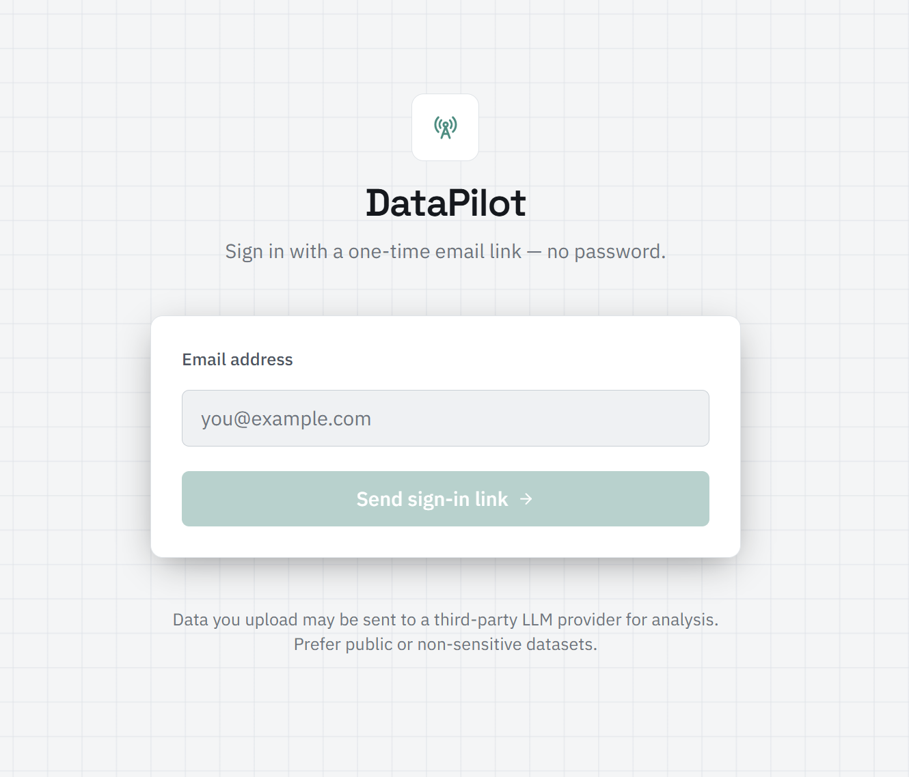
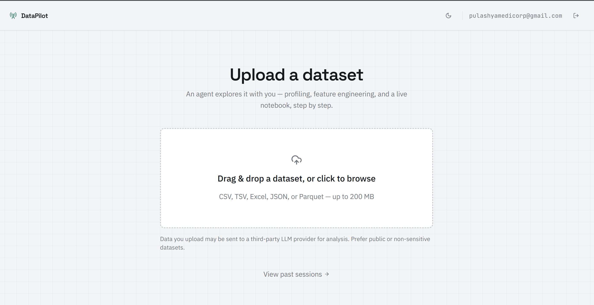

# DataPilot

DataPilot is an agentic exploratory-data-analysis (EDA) and feature-engineering assistant.
Upload a dataset, and an LLM agent profiles it, proposes a problem type, plans and runs real
analysis code in a sandboxed Jupyter kernel, surfaces insights as it goes, and **pauses at key
decisions** (dropping columns, imputation, encoding, suspected leakage) so you stay in the loop.
A live notebook is the single source of truth for everything the agent does, and you can ask it
questions about the data or any step at any time.

## Contents

- [Features](#features)
- [Demo](#demo)
- [Screenshots](#screenshots)
- [Architecture](#architecture)
- [Tech stack](#tech-stack)
- [Getting started](#getting-started)
- [Getting an LLM API key](#getting-an-llm-api-key)
- [Environment variables](#environment-variables)
- [Usage walkthrough](#usage-walkthrough)
- [Testing](#testing)
- [Project structure](#project-structure)

## Features

- **Passwordless auth** — email magic-link sign-in, no external OAuth app to register.
- **Any tabular file** — CSV, TSV, Excel (with sheet selection), JSON/JSONL, Parquet, up to
  a configurable size limit.
- **Automatic profiling** — column types, missingness, distributions, a data-quality score,
  and a virtualized preview table, computed the moment a file is uploaded.
- **An agent that plans out loud** — detects the problem type (classification, regression,
  clustering, time series) and proposes a plan of analysis steps you can edit, reorder, or
  skip before it runs anything.
- **Sandboxed, reproducible execution** — one Jupyter kernel per session, in a network-isolated
  Docker container; every action is a real notebook cell, not a canned chart.
- **Human-in-the-loop decisions** — the agent pauses at target confirmation, plan approval,
  feature-engineering choices, and baseline-model approval, always with a recommended default.
- **Ask about your data anytime** — a chat panel grounded in the actual notebook cells and
  insights (never the raw dataset), with `@cell-N` references to pull a specific cell into
  context.
- **Feature engineering & baseline model** — a fitted scikit-learn pipeline plus a quick
  baseline model with metrics, feature importance, and a SHAP summary, exportable as a
  `pipeline.joblib`.
- **Notebook & report export** — download the session as a runnable `.ipynb` (re-executed
  top-to-bottom before export to guarantee it works) or a self-contained HTML report.
- **Hardened for real use** — per-IP API rate limiting, per-session compute budgets, fast
  crash detection and kernel recovery, and a cost-budgeted LLM client so a runaway session
  can't drain your API balance.

## Demo

A full walkthrough (sign in → upload → agent run → decisions → chat → export), screen-recorded.

Save your recording as `docs/demo.mp4` and it will play inline here:

<video src="docs/demo.mp4" controls width="100%"></video>

> GitHub renders the `<video>` tag above as an inline player once `docs/demo.mp4` exists in the
> repo. If a renderer you're using shows only a link instead, convert the clip to a GIF and use
> `` instead for a guaranteed-inline preview everywhere.

## Screenshots

| Screenshot | Save as |
|---|---|
| Login page — email input, "Send magic link" | `docs/screenshots/login.png` |
| Upload page — the dropzone for uploading a dataset | `docs/screenshots/upload.png` |





## Architecture

```
[Next.js UI] <--SSE/HTTP--> [FastAPI API] <--> [LangGraph Agent] --tools--> [Kernel Manager] --> [Sandboxed Jupyter Kernel (Docker, no outbound network)]
                                  |                    |
                             [Postgres]           [LLMClient (LiteLLM)] --> DeepSeek (primary) / Groq (fallback) / Ollama (optional local)
                             [Redis]
                             [S3 / MinIO: uploads, exports, pipeline artifacts]
```

- Each **session** owns: an uploaded dataset, one live kernel, one notebook (ordered cells +
  outputs), a chat history, an agent checkpoint, a decision log, and an LLM usage/cost record.
- The kernel runs as two containers — a locked-down **kernel** container (read-only rootfs,
  no outbound network) and a thin **relay** container that bridges its ZMQ ports back to the
  host — so a kernel can be reached without ever giving it real network access.
- The agent graph (`ingest -> understand -> plan -> execute_step (loop) -> feature_engineering
  -> baseline -> summarize`) runs on LangGraph with a Postgres checkpointer, pausing via
  `interrupt()` at human-in-the-loop decision points instead of a custom pause mechanism.
- Only two node types ever call the LLM (target/problem-type proposal, and error repair during
  execution); planning, template runs, and the final summary are deterministic, to keep every
  session's LLM spend as small as possible.

A more polished architecture diagram can go at `docs/architecture.png` — drop one in and
reference it here (``) if you'd like a visual instead of
the ASCII sketch above.

## Tech stack

| Layer | Choices |
|---|---|
| Frontend | Next.js (App Router) + TypeScript, Tailwind CSS, `react-plotly.js`, `react-markdown` |
| Backend | FastAPI, Pydantic v2, SQLAlchemy 2 + Alembic, PostgreSQL, Redis, S3/MinIO |
| Agent | LangGraph (Postgres-checkpointed), LiteLLM (`app/agent/llm.py`) — provider is config-only, currently DeepSeek with Groq fallback |
| Execution | One Jupyter kernel per session, sandboxed in Docker via `jupyter_client` |
| Testing | pytest + ruff + mypy (backend), Vitest + ESLint + `tsc` (frontend), Playwright (e2e) |

## Getting started

### Prerequisites

- Docker and Docker Compose (recommended path — runs everything, including the sandboxed
  kernel containers).
- For local (non-Docker) backend/frontend development: Python 3.12+, Node.js 18+, and a
  reachable Postgres, Redis, and MinIO (Docker Compose can still provide just those three).

### Quickstart (Docker Compose)

```bash
git clone <this-repo-url>
cd DataPilot
cp .env.example .env
# fill in DEEPSEEK_API_KEY (see "Getting an LLM API key" below) and AUTH_SECRET_KEY

# build the sandboxed kernel images once, from backend/
docker build -t datapilot-kernel:latest backend/kernel_image/
docker build -t datapilot-kernel-relay:latest backend/relay_image/

docker compose up --build
```

Then, once Postgres is up, apply migrations (only needed the first time / after a schema
change):

```bash
docker compose exec backend alembic upgrade head
```

- Frontend: http://localhost:3000
- Backend: http://localhost:8000 (health check at `/health`)

With `SMTP_HOST` left empty (the default), signing in doesn't need a real mailbox: the
`/auth/request-link` response returns the magic link directly and logs it — copy it from the
backend logs, or from the response, and open it in the browser to finish signing in.

### Local development without Docker for the app itself

```bash
# backend, from backend/
pip install -e ".[dev]"
alembic upgrade head
python -m app          # on Windows, use this instead of `uvicorn app.main:app` directly —
                        # it sets the event loop policy before uvicorn creates its loop, which
                        # the LangGraph Postgres checkpointer needs

# frontend, from frontend/
npm install
npm run dev
```

You still need Postgres, Redis, and MinIO reachable (`docker compose up postgres redis minio`
covers just those), and the kernel images built if you want real (non-mock) analysis runs.

## Getting an LLM API key

DataPilot talks to the LLM only through `LLM_MODEL`/`LLM_FALLBACKS` in `.env` — no code change
is needed to switch providers, since every call goes through LiteLLM.

**DeepSeek (the configured default):**

1. Go to https://platform.deepseek.com/ and sign up.
2. Open the "API Keys" section of the dashboard and create a new key.
3. Add credit to your account (DeepSeek is pay-as-you-go; there's no free tier).
4. Put the key in `.env` as `DEEPSEEK_API_KEY=...`, and leave `LLM_MODEL=deepseek/<current-deepseek-chat-model>` pointed at whichever DeepSeek chat model you want to use.

**Optional fallback (Groq):** sign up at Groq's console, create an API key, set
`GROQ_API_KEY` and add `groq/<model>` to `LLM_FALLBACKS`. LiteLLM will fail over to it if
DeepSeek is rate-limited or unreachable.

**Running without any key:** set `LLM_MODEL=mock` — every LLM call is short-circuited by a
deterministic heuristic, at zero cost. This is what the whole test suite and CI run under.

Before relying on a real key, verify it actually works end to end:

```bash
cd backend
python scripts/verify_llm.py
```

## Environment variables

All variables live in `.env` (see [`.env.example`](./.env.example) for the full annotated
list). The ones you're most likely to touch:

| Variable | Purpose |
|---|---|
| `LLM_MODEL` / `LLM_FALLBACKS` | Which LiteLLM-routed model(s) the agent uses |
| `DEEPSEEK_API_KEY` / `GROQ_API_KEY` | Provider credentials |
| `LLM_MAX_CALLS_PER_SESSION` / `LLM_MAX_COST_PER_SESSION_USD` | Per-session spend guardrails |
| `AUTH_SECRET_KEY` | Signs session cookies — set a real random value outside local dev |
| `SMTP_HOST` (and friends) | Leave empty for local dev (magic link returned directly); fill in to send real email |
| `API_RATE_LIMIT_PER_MINUTE` | Per-IP API rate limit (`0` disables it) |
| `KERNEL_SESSION_COMPUTE_BUDGET_SECONDS` | Cumulative kernel compute time allowed per session (`0` disables it) |
| `DATABASE_URL` / `REDIS_URL` / `S3_*` | Infra connection strings |

## Usage walkthrough

1. **Sign in** with your email — no password, just a magic link.
2. **Upload a dataset** (CSV, Excel, JSON, or Parquet). DataPilot profiles it immediately:
   column types, missingness, a data-quality score, and a preview.
3. **Confirm the target and problem type** the agent proposes (or pick a different column —
   problem type is re-derived automatically, no extra LLM call).
4. **Review and edit the analysis plan**, then let the agent run it — it writes and executes
   real notebook cells, one template at a time, explaining what it finds as it goes.
5. **Answer decisions** as they come up (dropping columns, imputation strategy, encoding,
   feature-engineering parameters, whether to train a baseline model) — always with a
   recommended default you can accept with one click.
6. **Ask questions** in the chat panel at any point — reference a specific cell with
   `@cell-<number>` to ground the answer in its code/output.
7. **Export** the finished notebook (`.ipynb`, re-verified to run top-to-bottom), a
   self-contained HTML report, or the fitted pipeline (`pipeline.joblib`).

## Testing

```bash
# backend (from backend/) — needs a reachable Postgres; MinIO too for storage tests
pytest
pytest -m docker          # real sandboxed-kernel integration tests (build the kernel images first)

# frontend (from frontend/)
npm test
npm run test:e2e          # needs the full real stack running, LLM_MODEL=mock

# evaluation suite — real, paid LLM calls; never run in CI
python backend/eval/run_eval.py
```

## Project structure

```
DataPilot/
├── backend/
│   ├── app/
│   │   ├── agent/        # LangGraph graph, nodes, LLM client, Q&A, decisions
│   │   ├── analysis/      # Analysis templates (EDA, per-problem-type, feature engineering)
│   │   ├── api/           # FastAPI routers (auth, sessions, notebook, agent, health)
│   │   ├── core/          # Config, security, email, rate limiting
│   │   ├── execution/      # Kernel manager + Docker execution backend
│   │   ├── models/        # SQLAlchemy models
│   │   ├── notebook/       # Notebook cell store, seeding, export (.ipynb / HTML)
│   │   └── schemas/        # Pydantic request/response schemas
│   ├── kernel_image/       # Sandboxed Jupyter kernel Docker image
│   ├── relay_image/        # ZMQ port relay Docker image
│   ├── eval/                # Evaluation suite (synthetic benchmark datasets)
│   ├── migrations/          # Alembic migrations
│   └── tests/
├── frontend/
│   ├── app/                 # Next.js App Router pages (login, sessions, session detail)
│   ├── components/          # UI components (notebook, chat, insights, decisions, upload…)
│   ├── lib/                  # API client, theme handling, severity config
│   └── e2e/                   # Playwright end-to-end test
├── docs/
│   ├── screenshots/            # Login/upload screenshots — see "Screenshots" above
│   └── demo.mp4                 # Screen-recorded demo — see "Demo" above
└── docker-compose.yml
```
